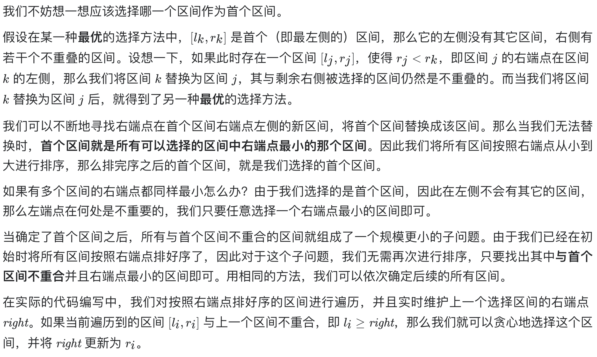

# [435. 无重叠区间](https://leetcode-cn.com/problems/non-overlapping-intervals/)

## 解题思路



## 复杂度分析

**时间复杂度：O(NlogN)**

**空间复杂度：O(logN)** 

## 代码实现

```golang
func eraseOverlapIntervals(intervals [][]int) int {
	n := len(intervals)
	if n == 0 {
		return 0
	}
	sort.Slice(intervals, func(i, j int) bool { return intervals[i][1] < intervals[j][1] })
	ans, right := 1, intervals[0][1]
	for _, p := range intervals[1:] {
		if p[0] >= right {
			ans++
			right = p[1]
		}
	}
	return n - ans
}
```