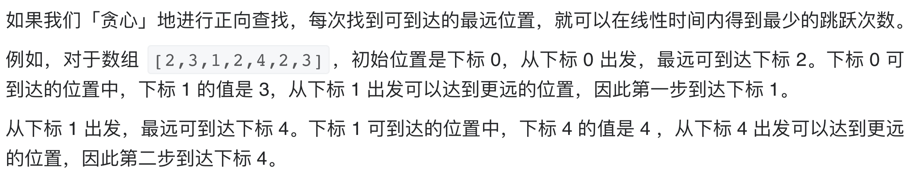
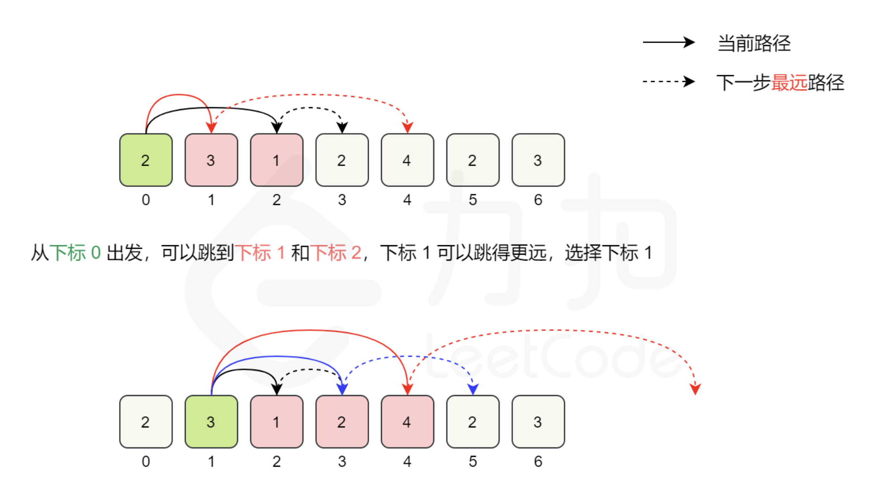

# [45. 跳跃游戏 II](https://leetcode-cn.com/problems/jump-game-ii/)

## 解题思路






## 复杂度分析

**时间复杂度：O(N)**

**空间复杂度：O(1)** 

## 代码实现

```golang
func jump(nums []int) int {
	n := len(nums)
	longest := 0 // 记录最远可达位置
	end, steps := 0, 0
	for i := 0; i < n-1; i++ {
		if nums[i]+i > longest { // 更新最远可达位置
			longest = nums[i] + i
		}
		if i == end { // 每次达到上一步的边界则更新跳跃次数
			end = longest
			steps++
		}
	}
	return steps
}
```