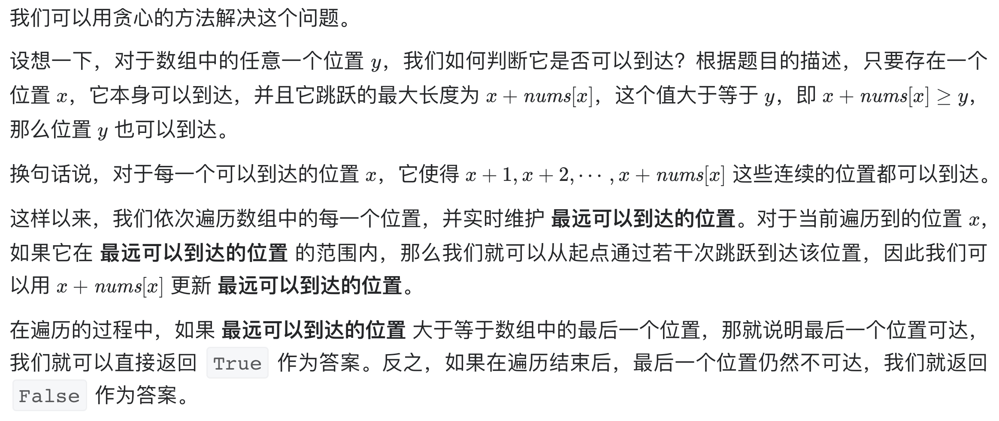
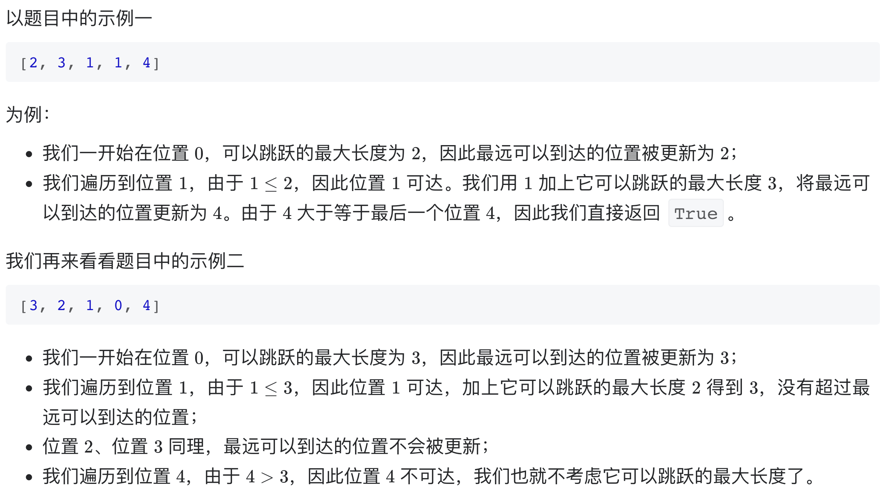

# [55. 跳跃游戏](https://leetcode-cn.com/problems/jump-game/)

## 解题思路





## 复杂度分析

**时间复杂度：O(N)**

**空间复杂度：O(1)** 

## 代码实现

```golang
func canJump(nums []int) bool {
	n := len(nums)
	longest := 0 // 记录最远可达位置
	for i := 0; i < n; i++ {
		if i > longest { // 当前位置不可达
			return false
		}
		if nums[i]+i > longest { // 更新最远可达位置
			longest = nums[i] + i
		}
		if longest >= n-1 { // 可达末尾
			return true
		}
	}
	return false
}
```